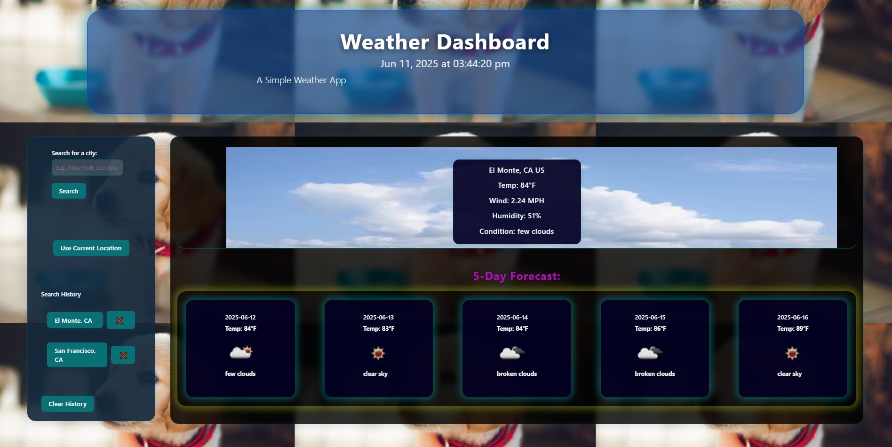

# Weather-Dashboard-KP
[Live Demo](https://khoiphan-9194.github.io/Weather-Dashboard-KP/)

---

**Weather-Dashboard-KP** is a modern web application that provides users with up-to-date weather information for cities around the globe. Designed with usability and accessibility in mind, this dashboard allows users to search for any city and instantly view detailed weather data, including current conditions and a 5-day forecast. The intuitive interface makes it easy to check the weather before traveling, planning outdoor activities, or simply staying informed. By leveraging real-time data from the OpenWeatherMap API and saving recent searches locally, the app delivers a seamless and personalized experience across devices.

---

**Labels:**  
`weather` `dashboard` `responsive` `javascript` `bootstrap` `openweathermap` `webapp` `localstorage` `jquery`

---

## Purpose

**Weather-Dashboard-KP** is a responsive web application designed to help users quickly access weather information for any city worldwide. Users can enter a city name to view the current weather, including temperature, humidity, wind speed, and weather conditions. The app also displays a 5-day weather forecast, enabling users to plan ahead for travel, events, or daily activities. Recent searches are saved locally, allowing users to revisit previous cities with a single click.

## Technologies Used

- **HTML5**: Provides the structure and semantic markup for the application.
- **CSS3**: Styles the user interface for a clean and modern look.
- **Bootstrap**: Ensures responsive design and consistent layout across devices.
- **JavaScript (ES6)**: Implements application logic, event handling, and dynamic content updates.
- **jQuery**: Simplifies DOM manipulation and AJAX requests.
- **OpenWeatherMap API**: Supplies real-time weather data and forecasts.
- **Local Storage API**: Stores recent search history in the user's browser.
- **GitHub Pages**: Hosts and deploys the application for public access.

## Screenshot

This combination of technologies ensures a fast, interactive, and user-friendly experience for anyone needing reliable weather information.

## License

SVG Logo Maker © is licensed under the ISC license.  

For more information regarding the SVG Logo Maker's license, please visit: 
https://opensource.org/licenses/MIT

## Questions?
  
### Github:[khoiphan-9194](https://github.com/khoiphan-9194)
  
### Reach Me Via Email: phanminhkhoi91@gmail.com

Thanks for viewing!

